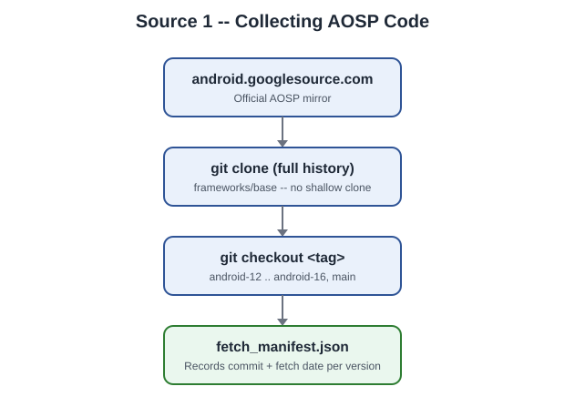
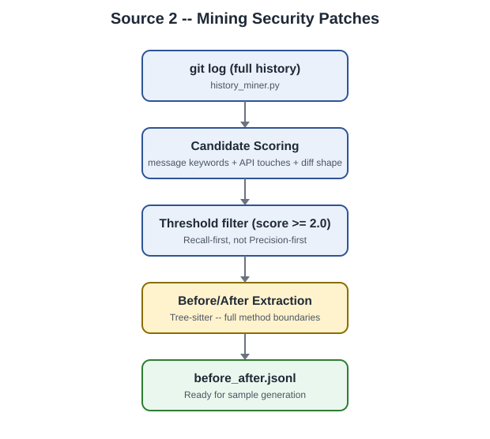
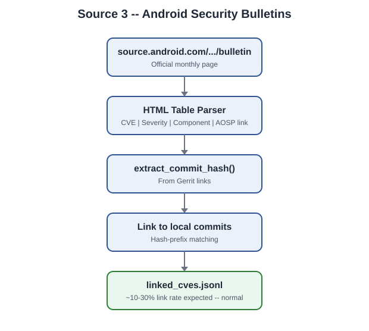
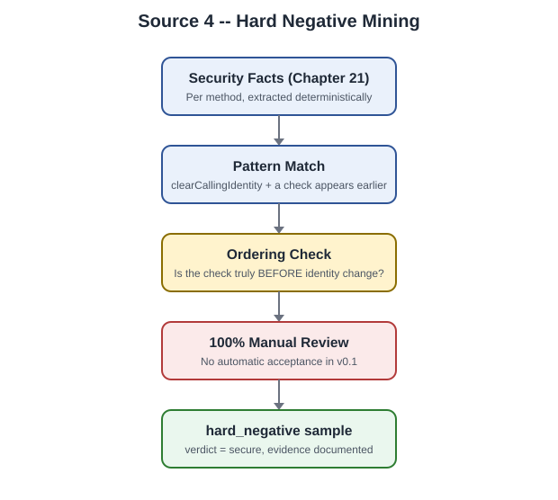
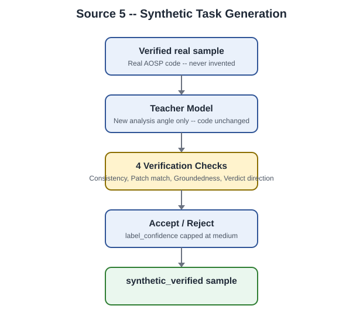

[← الجزء التاسع والعشرون](./part-29-calibration-and-beyond.md) · [الفهرس](./README.md)

# الجزء الثلاثون: التعمق في مصادر البيانات

هذا الجزء إضافة تفصيلية على ما ورد سابقًا في الأجزاء 6-9، 14-15، و26 — يجمع كل مصادر الـDataset الخمسة في مكان واحد، بتفاصيل تشغيلية عملية (روابط حقيقية، معدلات نجاح متوقَّعة، مشاكل شائعة) لم تُذكَر بنفس التركيز من قبل، مع رسم بياني لكل مصدر.

## الفصل 55: مصدر 1 — كود AOSP نفسه (المصدر الأساسي)

### 55.1 من أين بالضبط

الرابط الرسمي: `https://android.googlesource.com/platform/frameworks/base`. هذه **مرآة Git رسمية من Google** — وليست GitHub mirror طرف ثالث (رغم وجود مرايا على GitHub أيضًا، ننصح بالمصدر الرسمي لضمان دقة الـtags).

### 55.2 لماذا `frameworks/base` تحديدًا وليس AOSP كاملة

AOSP الكاملة (عبر `repo` tool) تضم مئات المستودعات الفرعية (kernel, hardware drivers, apps, toolchains...) بحجم يتجاوز عشرات الجيجابايت. مشروعنا يركّز على `frameworks/base` لأنه يحتوي الغالبية العظمى من `system_server` والخدمات المميزة (الفصل 4). التوسع لمستودعات أخرى (مثل `packages/modules`) يحدث فقط عند حاجة فعلية موثَّقة، وليس استباقيًا.

### 55.3 حجم البيانات المتوقَّع فعليًا

| العنصر | الحجم التقريبي |
|---|---|
| `frameworks/base` لإصدار واحد (بدون تاريخ) | ~1.5-2.5 GB |
| نفس المستودع بالتاريخ الكامل | ~4-6 GB (يعتمد على عمق التاريخ) |
| ست نسخ (android-12 إلى 16 + main) بالتاريخ الكامل | ~25-35 GB تقريبًا |

**تخطيط مساحة تخزين:** احجز على الأقل 50GB فارغة قبل بدء الجزء السادس، مع مراعاة أن أول `git clone` كامل قد يستغرق ساعة أو أكثر حسب سرعة الإنترنت.

### 55.4 مشاكل شائعة وحلولها

| المشكلة | السبب المحتمل | الحل |
|---|---|---|
| `git clone` يتوقف أو يفشل منتصف الطريق | استقرار الاتصال، أو timeout على مستودع ضخم | استخدم `git clone --depth` مؤقتًا للاختبار، ثم `git fetch --unshallow` لاحقًا لجلب التاريخ الكامل |
| Tag غير موجود (`fatal: reference is not a tree`) | رقم الإصدار (`_rXX`) تغيّر منذ كتابة هذا الكتاب (الفصل 13.3 نبّه لهذا) | نفّذ `git ls-remote --tags <url> \| grep android-14` لإيجاد أحدث tag فعلي |
| مساحة القرص تمتلئ أثناء الجلب | ست نسخ كاملة بالتاريخ حجمها كبير فعليًا | فكّر في جلب إصدارين أو ثلاثة فقط في البداية (v0.1)، وتوسيع لاحقًا |

---

## الفصل 56: مصدر 2 — تعدين Security Patches من تاريخ Git

### 56.1 لا يوجد مصدر خارجي منفصل هنا

هذا المصدر **لا يتطلب أي رابط أو API خارجي جديد** — هو استخراج من نفس مستودع Git الذي جلبناه في المصدر 1، عبر تحليل الـcommit history المحلي بالكامل بواسطة `patch_miner/history_miner.py` و`candidate_scorer.py` (الفصل 15-16).

### 56.2 معدلات النجاح الواقعية المتوقَّعة

| المرحلة | نسبة تقريبية من المُدخَل |
|---|---|
| Commits خام في `services/core` عبر تاريخ إصدار واحد | عشرات الآلاف |
| Candidates بعد `candidate_scorer.py` (score >= 2.0) | ~3-8% من الإجمالي تقريبًا |
| Before/After pairs ناجحة الاستخراج (كلا الطرفين موجودان) | ~60-80% من الـCandidates (البعض يفشل بسبب methods جديدة بالكامل أو محذوفة) |

**الخلاصة العملية:** من كل 10,000 commit خام، توقّع الوصول لحوالي 300-800 candidate، ومنها 200-600 before/after pair صالح — وهذا الرقم يتوسع لاحقًا عبر الفصل 29 (كل pair يُنتج حتى 6 samples).

### 56.3 نصيحة تشغيلية

شغّل `history_miner.py` أولًا على نطاق زمني محدود (سنة واحدة مثلًا عبر `--since`/`--until` في الفصل 15.2) للتحقق من جودة الإشارات قبل تشغيله على تاريخ الإصدار الكامل — تشغيل كامل قد يستغرق ساعات على تاريخ يمتد لسنوات.

---

## الفصل 57: مصدر 3 — Android Security Bulletins

### 57.1 الرابط الرسمي

الفهرس الكامل: `https://source.android.com/docs/security/bulletin/asb-overview`. كل نشرة شهرية لها رابط بالصيغة `https://source.android.com/docs/security/bulletin/YYYY-MM-01`.

### 57.2 لماذا نسبة الربط منخفضة، ولماذا هذا طبيعي

كما ذُكِر في الفصل 18.5: **10-30% نسبة ربط ناجح بين CVE وcommit محلي هي نتيجة متوقَّعة وليست خطأً في السكريبت**. الأسباب الثلاثة الرئيسية:
- بعض CVEs تُصلَح في مستودعات خارج `frameworks/base` (native code, drivers خاصة بمصنّعين).
- بعض الروابط تشير لأنظمة Gerrit داخلية غير عامة الوصول.
- بعض الـCVEs قديمة جدًا (قبل أقدم إصدار جلبناه في المصدر 1).

### 57.3 نصيحة عملية للتحديث الدوري

هذا المصدر الوحيد من الخمسة الذي **يحتاج تحديثًا شهريًا متكررًا** (نشرة جديدة كل شهر) — على عكس المصادر الأخرى التي تُجمَع دفعة واحدة أساسًا. فكّر في جدولة تشغيل `fetch_bulletins.py` (الفصل 18.3) كمهمة دورية (cron job شهري) بدل تشغيل يدوي متكرر.

---

## الفصل 58: مصدر 4 — Hard Negative Mining

### 58.1 لماذا هذا المصدر الأبطأ من حيث الإنتاجية

على عكس المصادر الثلاثة الأولى (آلية بالكامل تقريبًا)، هذا المصدر يتطلب **مراجعة بشرية 100%** لكل candidate (الفصل 31.5) — لا استثناء في v0.1. هذا يعني إنتاجية أبطأ بكثير (عشرات وليس مئات العينات في الساعة)، لكنه أهم مصدر لتقليل False Positives (الفصل 5.4).

### 58.2 نصيحة توزيع الجهد

لو الوقت محدود، الأولوية القصوى لهذا المصدر يجب أن تكون للأنماط الثلاثة الأخطر إحصائيًا حسب Taxonomy الفصل 10: **Cross-user gaps**، **Package ownership gaps**، ثم **Identity transition ordering**. باقي الأنماط (AppOps الآمنة، إلخ) يمكن تأجيلها لـDataset v0.2 دون خسارة كبيرة في v0.1.

---

## الفصل 59: مصدر 5 — Synthetic Task Generation

### 59.1 هذا المصدر آخر أولوية زمنية، وليس أول

بخلاف الترتيب الرقمي، عمليًا **لا نبدأ بهذا المصدر أبدًا** — هو مكمّل يُستخدَم فقط بعد استنفاد المصادر الأربعة الأولى ووجود فجوة حقيقية موثَّقة (فئة من Taxonomy الفصل 10 نادرة جدًا في البيانات الحقيقية المتوفرة). البدء به مبكرًا يخاطر بإنتاج Dataset يعتمد بشكل مفرط على نصوص مُولَّدة بدل أدلة حقيقية من AOSP.

### 59.2 هذا هو المصدر الذي يحتاج Teacher Model

الفصل التالي (الجزء الحادي والثلاثون) مخصص بالكامل لاختيار وربط الـTeacher Model المستخدَم هنا وفي عمليات التحقق (الفصل 50) — لأن هذا المصدر تحديدًا (وأيضًا صياغة نصوص `candidate_issue` لعينات المصادر الأخرى، لو رغبنا في تنويع الصياغة) هو ما يتطلب استدعاء نموذج خارجي فعليًا.

---

## جدول مقارنة سريع للمصادر الخمسة

| # | المصدر | يحتاج API خارجي؟ | آلي بالكامل؟ | الأولوية الزمنية |
|---|---|---|---|---|
| 1 | AOSP Source Code | لا (git فقط) | نعم | أول خطوة، لا بديل |
| 2 | Patch Mining | لا (git محلي) | نعم | فور توفر المصدر 1 |
| 3 | Security Bulletins | لا (web scraping) | نعم، لكن يحتاج تحديث دوري | بالتوازي مع المصدر 2 |
| 4 | Hard Negative Mining | لا | جزئي (ترشيح آلي + مراجعة بشرية إلزامية) | بعد استقرار المصدر 2 |
| 5 | Synthetic Generation | **نعم — Teacher Model** | جزئي (توليد آلي + تحقق آلي وبشري) | آخر أولوية، فقط لسد فجوات موثَّقة |

---

[← الجزء التاسع والعشرون](./part-29-calibration-and-beyond.md) · [الفهرس](./README.md) · [الجزء الحادي والثلاثون →](./part-31-teacher-model.md)
