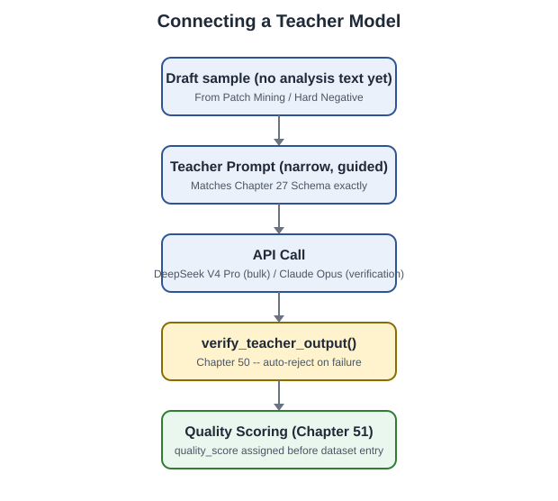

[← الجزء الثلاثون](./part-30-data-sources-deep-dive.md) · [الفهرس](./README.md)

# الجزء الحادي والثلاثون: اختيار وربط Teacher Model



هذا الجزء يكمل الفصل 50 (Teacher Model Workflow) بقرار عملي: **أي نموذج تحديدًا نستخدم**، وكيف نربطه فعليًا بالـPipeline. المعلومات هنا محدَّثة بحسب حالة السوق وقت كتابة هذا الجزء (أغسطس 2026) — راجع دائمًا الأسعار والمواصفات الرسمية وقت التنفيذ الفعلي لأن هذا المجال يتغيّر بسرعة كبيرة (تمامًا كما حذّر الفصل 40.1 من تثبيت اسم نموذج طالب واحد، نفس التحذير ينطبق هنا على نموذج المعلّم).

## الفصل 60: معايير الاختيار والمقارنة الفعلية

### 60.1 لماذا معايير الطالب (الفصل 40) لا تنطبق هنا حرفيًا

نموذج الطالب (Student — الفصل 40) يجب أن يعمل محليًا على 16GB VRAM. نموذج المعلّم (Teacher) **لا يُدرَّب ولا يعمل محليًا أبدًا** — هو استدعاء API خارجي فقط، لتوليد أو التحقق من نصوص التحليل (الفصل 49-50). لذلك معايير الاختيار مختلفة جوهريًا:

| المعيار | لماذا يهم هنا تحديدًا |
|---|---|
| **جودة الـReasoning الأمني** | يجب أن يفهم Binder identity، Cross-user authorization، بدقة كافية ليكون مرجعًا نتحقق ضده (الفصل 50.2) |
| **موثوقية JSON المُهيكَل** | يجب أن يلتزم بـSchema الفصل 27 بدقة عالية — كل فشل تنسيق يعني عينة مرفوضة أو تحتاج إعادة محاولة |
| **التكلفة عند الحجم الكبير** | نولّد/نتحقق من آلاف العينات — تكلفة الـtoken تتراكم بسرعة، على عكس استخدام تفاعلي بسيط |
| **حجم نافذة السياق** | عينات الفصل 26 قد تصل لعدة آلاف token (method + caller + helpers) — يجب أن يستوعبها النموذج بارتياح |
| **إمكانية الوصول عبر API قياسي** | تكامل سهل عبر REST/SDK قياسي (OpenAI-compatible أو Anthropic-compatible) بدون بنية تحتية إضافية |

### 60.2 مقارنة المرشحين الفعليين (أغسطس 2026)

| النموذج | نقاط القوة لمهمتنا | التكلفة التقريبية (لكل مليون token) | Context |
|---|---|---|---|
| **DeepSeek V4 Pro** | reasoning قوي، دعم رسمي لـstructured output عبر JSON Schema، سياق 1M token، وضع "thinking" للتحليل الأمني المعقّد | $0.435 إدخال / $0.87 إخراج (أسعار عادية، خصم كبير عند تطابق الـcache) | 1,048,576 token |
| **DeepSeek V4 Flash** | أرخص بكثير، سريع، مناسب للتوليد الأولي بكميات كبيرة (Bulk) قبل التحقق | $0.14 إدخال / $0.28 إخراج | 1,048,576 token |
| **Claude (فئة Opus، أعلى مستوى متاح لحظة التنفيذ)** | من أقوى النماذج في الـReasoning الدقيق والالتزام بالتعليمات الصارمة — مناسب كطبقة تحقق نهائية عالية الثقة | أعلى تكلفة من DeepSeek بشكل ملحوظ | يختلف حسب الإصدار — راجع التوثيق الرسمي وقت التنفيذ |
| **GPT-5.4** | أداء قوي في الـReasoning البنيوي وقابلية الاعتماد على المخرجات المهيكَلة | متوسط إلى مرتفع | يختلف حسب الإصدار |
| **Qwen3.5 / GLM-5.1** | بديل مفتوح الوزن، يمكن استضافته ذاتيًا لتقليل التكلفة إن توفرت بنية تحتية GPU إضافية خارج جهاز التدريب المحلي | يعتمد على الاستضافة | يختلف حسب الإصدار |

> **تنبيه محوري:** هذه الأسعار والمواصفات **ستتغيّر** — بعض مزودي الخدمة (DeepSeek تحديدًا) أعلنوا صراحة عن زيادات أسعار مستقبلية غير محدَّدة التاريخ وقت كتابة هذا الجزء. لا تُدرِج هذه الأرقام في أي حساب ميزانية نهائي دون التحقق من صفحة الأسعار الرسمية للمزوّد في نفس يوم التنفيذ.

### 60.3 القرار الموصى به: نهج طبقي (Tiered)، وليس نموذجًا واحدًا

بدل اختيار نموذج واحد لكل شيء، نستخدم طبقتين — تمامًا كما فصّل الفصل 50 بين التوليد والتحقق:

```
الطبقة 1 — التوليد بالجملة (Bulk Generation)
    نموذج: DeepSeek V4 Pro (وضع thinking)
    الاستخدام: توليد المسودة الأولى لنصوص analysis.* لآلاف العينات
    السبب: توازن ممتاز بين جودة الـreasoning والتكلفة عند الحجم الكبير

الطبقة 2 — التحقق عالي الثقة (High-Confidence Verification)
    نموذج: Claude (فئة Opus) أو GPT-5.4
    الاستخدام: فقط للعينات التي اجتازت التحقق الآلي (الفصل 50.2) وتحتاج
               تأكيدًا نهائيًا قبل الترقية لـlabel_confidence أعلى،
               أو لمراجعة الحالات الحدّية (edge cases) التي فشلت في
               الطبقة الأولى
    السبب: تكلفة أعلى لكن على حجم أصغر بكثير من العينات (فقط الحالات
           المشكوك فيها أو عالية الأهمية)
```

هذا التصميم يوازن بين التكلفة الإجمالية (معظم الحجم يمر بالنموذج الأرخص) والجودة النهائية (الحالات الحرجة تمر بمراجعة أقوى) — بدون التضحية بأي منهما بالكامل.

---

## الفصل 61: الربط الفعلي بالـPipeline

### 61.1 واجهة موحَّدة لكلا الطبقتين

بدل كتابة كود منفصل لكل مزوّد، نبني واجهة موحَّدة — يسهل تبديل النموذج المستخدَم دون تعديل بقية الـPipeline (يتماشى مع تحذير الفصل 40.1 ضد تثبيت اسم نموذج بعينه داخل منطق النظام).

```python
# teacher_model/client.py
"""
واجهة موحَّدة لاستدعاء نماذج المعلّم عبر مزوّدين مختلفين.
كلا المزوّدين هنا يدعمان واجهة متوافقة مع OpenAI أو Anthropic --
هذا الغلاف يوحّد الاستدعاء بصرف النظر عن المزوّد الفعلي.
"""
import os
import json
import time
from dataclasses import dataclass
from abc import ABC, abstractmethod

@dataclass
class TeacherResponse:
    raw_text: str
    parsed_json: dict | None
    parsing_succeeded: bool
    latency_seconds: float
    provider: str
    model_id: str

class TeacherModelClient(ABC):
    @abstractmethod
    def generate(self, system_prompt: str, user_prompt: str) -> TeacherResponse:
        ...

class DeepSeekClient(TeacherModelClient):
    """يستخدم واجهة DeepSeek المتوافقة مع OpenAI.
    base_url الرسمي: https://api.deepseek.com (أو /anthropic للتوافق مع Anthropic SDK)."""

    def __init__(self, model_id: str = "deepseek-v4-pro", thinking: bool = True):
        from openai import OpenAI  # pip install openai --break-system-packages
        api_key = os.environ["DEEPSEEK_API_KEY"]
        self.client = OpenAI(api_key=api_key, base_url="https://api.deepseek.com")
        self.model_id = model_id
        self.thinking = thinking

    def generate(self, system_prompt: str, user_prompt: str) -> TeacherResponse:
        start = time.time()
        response = self.client.chat.completions.create(
            model=self.model_id,
            messages=[
                {"role": "system", "content": system_prompt},
                {"role": "user", "content": user_prompt},
            ],
            response_format={"type": "json_object"},
            extra_body={"reasoning_effort": "high" if self.thinking else "none"},
        )
        latency = time.time() - start
        raw_text = response.choices[0].message.content

        parsed, success = _try_parse_json(raw_text)
        return TeacherResponse(
            raw_text=raw_text, parsed_json=parsed, parsing_succeeded=success,
            latency_seconds=round(latency, 2), provider="deepseek",
            model_id=self.model_id,
        )

class ClaudeVerifierClient(TeacherModelClient):
    """يستخدم Anthropic SDK القياسي -- مخصَّص لطبقة التحقق عالية الثقة
    (حجم استخدام أصغر بكثير من طبقة التوليد بالجملة)."""

    def __init__(self, model_id: str = "claude-opus-4-8"):
        import anthropic  # pip install anthropic --break-system-packages
        api_key = os.environ["ANTHROPIC_API_KEY"]
        self.client = anthropic.Anthropic(api_key=api_key)
        self.model_id = model_id

    def generate(self, system_prompt: str, user_prompt: str) -> TeacherResponse:
        start = time.time()
        response = self.client.messages.create(
            model=self.model_id,
            max_tokens=2000,
            system=system_prompt,
            messages=[{"role": "user", "content": user_prompt}],
        )
        latency = time.time() - start
        raw_text = "".join(
            block.text for block in response.content if block.type == "text"
        )

        parsed, success = _try_parse_json(raw_text)
        return TeacherResponse(
            raw_text=raw_text, parsed_json=parsed, parsing_succeeded=success,
            latency_seconds=round(latency, 2), provider="anthropic",
            model_id=self.model_id,
        )

def _try_parse_json(raw_text: str) -> tuple[dict | None, bool]:
    try:
        cleaned = raw_text.strip()
        if cleaned.startswith("```"):
            cleaned = cleaned.split("```")[1]
            if cleaned.startswith("json"):
                cleaned = cleaned[4:]
        return json.loads(cleaned), True
    except (json.JSONDecodeError, IndexError):
        return None, False
```

### 61.2 دمج الطبقتين في Pipeline واحد

```python
# teacher_model/tiered_pipeline.py
"""
يطبّق النهج الطبقي من الفصل 60.3: توليد بالجملة عبر DeepSeek، ثم
تحقق عالي الثقة عبر Claude فقط للعينات التي تحتاج ذلك -- إما لأنها
اجتازت الفحص الآلي (الفصل 50) وتستحق ترقية الثقة، أو لأنها فشلت
وتحتاج رأيًا ثانيًا قبل الرفض النهائي.
"""
from teacher_model.client import DeepSeekClient, ClaudeVerifierClient
from training.prompt_template import render_prompt

def generate_bulk(draft_sample: dict) -> dict:
    """الطبقة الأولى -- تعمل على كل العينات."""
    bulk_client = DeepSeekClient(model_id="deepseek-v4-pro", thinking=True)
    prompt = render_prompt(draft_sample["code_context"]["current_method"])

    response = bulk_client.generate(
        system_prompt="You are an Android Framework security reviewer...",  # الفصل 47
        user_prompt=prompt,
    )

    if not response.parsing_succeeded:
        draft_sample["provenance"]["reviewer"] = "teacher_model_parse_failed"
        draft_sample["provenance"]["label_confidence"] = "low"
        return draft_sample

    draft_sample["analysis"] = {**draft_sample.get("analysis", {}), **response.parsed_json}
    draft_sample["verdict"] = response.parsed_json.get("verdict", "insufficient_context")
    draft_sample["provenance"]["generation_method"] = "synthetic_verified"
    draft_sample["provenance"]["reviewer"] = f"bulk_{response.provider}_{response.model_id}"
    draft_sample["provenance"]["label_confidence"] = "low"  # حتى التحقق الآلي (61.3)
    return draft_sample

def escalate_to_high_confidence_review(
    sample: dict, security_facts: dict, code_context_text: str, is_before_patch: bool
) -> dict:
    """الطبقة الثانية -- فقط للعينات المرشَّحة (انظر السياسة في 61.3)."""
    verifier = ClaudeVerifierClient(model_id="claude-opus-4-8")

    verification_prompt = (
        f"Review this security analysis for accuracy against the code "
        f"context. Respond with a JSON object: "
        f'{{"agrees": true|false, "concerns": ["..."]}}.\n\n'
        f"Code context:\n{code_context_text}\n\n"
        f"Analysis to review:\n{sample['analysis']}"
    )
    response = verifier.generate(
        system_prompt="You are a senior Android security reviewer verifying "
                      "another analyst's work. Be skeptical and specific.",
        user_prompt=verification_prompt,
    )

    if response.parsing_succeeded and response.parsed_json.get("agrees"):
        sample["provenance"]["reviewer"] = f"verified_{response.model_id}"
        sample["provenance"]["label_confidence"] = "medium"  # لا يزال أقل من
        # مراجعة بشرية مباشرة، حتى بعد تحقق نموذجين -- يتماشى مع الفصل 50.4
    else:
        sample["provenance"]["reviewer"] = "verification_disagreement"
        sample["provenance"]["label_confidence"] = "low"
        sample["_verification_concerns"] = response.parsed_json.get("concerns", []) \
            if response.parsing_succeeded else ["parsing failed"]

    return sample
```

### 61.3 سياسة القرار: متى نستدعي الطبقة الثانية (الأغلى)

```python
# teacher_model/escalation_policy.py
def should_escalate(sample: dict, verification_result_from_ch50) -> bool:
    """لا نستدعي Claude لكل عينة -- فقط عند استيفاء أحد الشرطين،
    للحفاظ على تكلفة الطبقة الثانية منخفضة نسبيًا مقابل حجم الطبقة
    الأولى الكبير."""
    # الشرط 1: عينة اجتازت التحقق الآلي (الفصل 50) لكنها ستُستخدَم
    # كعينة benchmark (الجزء العشرون) -- تستحق تأكيدًا أقوى من المعتاد
    if sample.get("_intended_for_benchmark"):
        return True

    # الشرط 2: عينة فشلت التحقق الآلي لكن قريبة من الحد (borderline) --
    # قد يستحق رأيًا ثانيًا قبل الرفض النهائي بدل رفضها مباشرة
    if not verification_result_from_ch50.passed and \
       len(verification_result_from_ch50.issues) <= 1:
        return True

    return False
```

### 61.4 تقدير تكلفة تشغيل كامل (مثال توضيحي)

```python
# teacher_model/cost_estimator.py
"""
تقدير تقريبي فقط -- استبدل الأسعار بالأرقام الرسمية الحالية وقت
التنفيذ الفعلي (الفصل 60.2 حذّر من ذلك صراحة)."""

DEEPSEEK_V4_PRO_INPUT_PER_M = 0.435
DEEPSEEK_V4_PRO_OUTPUT_PER_M = 0.87
CLAUDE_OPUS_INPUT_PER_M = 15.0    # مثال تقريبي -- تحقق من السعر الفعلي
CLAUDE_OPUS_OUTPUT_PER_M = 75.0   # مثال تقريبي -- تحقق من السعر الفعلي

def estimate_cost(
    n_samples: int,
    avg_input_tokens: int = 2500,
    avg_output_tokens: int = 600,
    escalation_rate: float = 0.15,  # نسبة العينات التي تصل للطبقة الثانية
) -> dict:
    bulk_input_cost = (n_samples * avg_input_tokens / 1e6) * DEEPSEEK_V4_PRO_INPUT_PER_M
    bulk_output_cost = (n_samples * avg_output_tokens / 1e6) * DEEPSEEK_V4_PRO_OUTPUT_PER_M

    n_escalated = int(n_samples * escalation_rate)
    escalation_input_cost = (n_escalated * avg_input_tokens / 1e6) * CLAUDE_OPUS_INPUT_PER_M
    escalation_output_cost = (n_escalated * 300 / 1e6) * CLAUDE_OPUS_OUTPUT_PER_M  # رد أقصر عادة

    total = bulk_input_cost + bulk_output_cost + escalation_input_cost + escalation_output_cost

    return {
        "n_samples": n_samples,
        "n_escalated_to_tier2": n_escalated,
        "tier1_cost_usd": round(bulk_input_cost + bulk_output_cost, 2),
        "tier2_cost_usd": round(escalation_input_cost + escalation_output_cost, 2),
        "total_cost_usd": round(total, 2),
    }

if __name__ == "__main__":
    print(estimate_cost(n_samples=10000))
```

مثال ناتج تقريبي لـ10,000 عينة: تكلفة الطبقة الأولى بالكامل غالبًا تبقى في حدود عشرات الدولارات فقط (بفضل سعر DeepSeek المنخفض نسبيًا)، بينما تكلفة الطبقة الثانية (على الـ15% المُصعَّدة فقط) قد تعادلها أو تتجاوزها رغم صغر حجمها النسبي — وهذا بالضبط سبب تصميم النهج الطبقي بدل استخدام النموذج الأغلى على كل شيء.

### 61.5 ضوابط أمان تشغيلية إضافية

- **لا تُخزَّن مفاتيح API في الكود** — `DEEPSEEK_API_KEY` و`ANTHROPIC_API_KEY` تُقرَآن حصرًا من متغيرات البيئة (`os.environ`)، بنفس مبدأ `AFVRM_DB_PASSWORD` في الفصل 34.4.
- **Rate limiting**: نفّذ retry مع backoff تصاعدي لكلا المزوّدين — الفصل السابق (60) أشار لحدود تزامن مختلفة بين النماذج (DeepSeek V4 Flash يدعم تزامنًا أعلى بكثير من V4 Pro مثلًا)؛ لا تفترض نفس الحد لكل نموذج.
- **Batch processing**: عند توليد آلاف العينات، عالج على دفعات (مثلًا 100 عينة في المرة) مع حفظ تقدّمي (checkpoint) للنتائج — انقطاع الاتصال منتصف تشغيل طويل لا يجب أن يعني إعادة البدء من الصفر.

> **Definition of Done — الجزء الحادي والثلاثون:** تشغيل فعلي لـ`generate_bulk` على 20 عينة مسودة على الأقل عبر DeepSeek API، مع تشغيل `escalate_to_high_confidence_review` على العينات المرشَّحة منها فقط (حسب `should_escalate`)، وتوثيق فعلي للتكلفة الحقيقية المُتكبَّدة مقابل تقدير `cost_estimator.py` — لمعايرة دقة التقدير قبل تشغيله على نطاق Milestone 1-2 الكامل (آلاف العينات).

---

[← الجزء الثلاثون](./part-30-data-sources-deep-dive.md) · [الفهرس](./README.md) · [الجزء الثاني والثلاثون →](./part-32-agent-architecture.md)
