[← الجزء الرابع والثلاثون](./part-34-confirmation-tiers-containment.md) · [الفهرس](./README.md)

# الجزء الخامس والثلاثون: الدليل البصري — خرائط ورسومات لكل مرحلة

هذا الجزء مرجع بصري موحَّد يجمع كل رسومات الـPipeline عبر الكتاب في مكان واحد، مرتبة بترتيب تدفّق المشروع الفعلي من البداية للنهاية. كل رسمة مرتبطة بالفصل التفصيلي اللي بتشرحه، فيمكن استخدام هذا الجزء كخريطة سريعة قبل الرجوع للتفاصيل الكاملة في مكانها.

## 1. المعمارية الكاملة للنظام

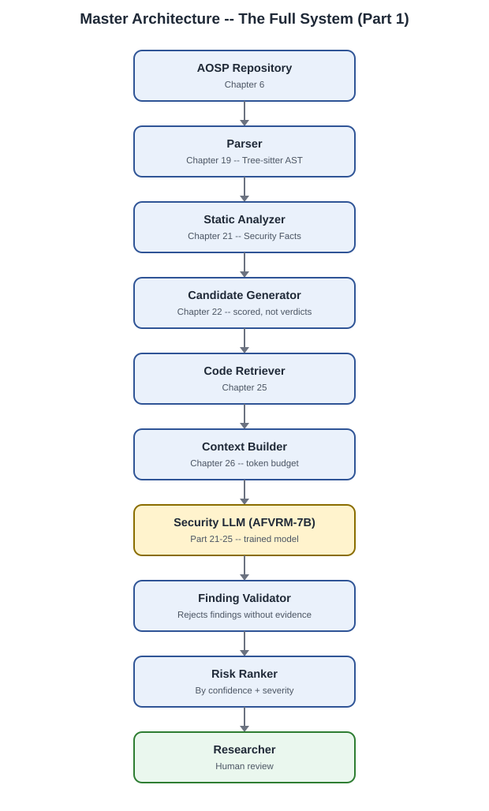

الخريطة الأم لكل المشروع — من AOSP الخام لحد الباحث البشري. كل صندوق هنا هو جزء كامل من الكتاب. راجع [الفصل 1](./part-01-project-definition.md) للتفاصيل الكاملة لكل طبقة ومسؤوليتها.

---

## 2. جمع البيانات ومصادرها

الثلاث خطوات الأولى لجمع البيانات الخام — راجع [الجزء السادس](./part-06-aosp-collection.md)، [الجزء السابع](./part-07-patch-mining.md)، و[الجزء الثامن](./part-08-security-bulletins.md).

---

## 3. الاستخراج والتحليل الثابت

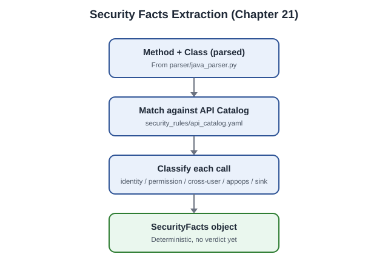

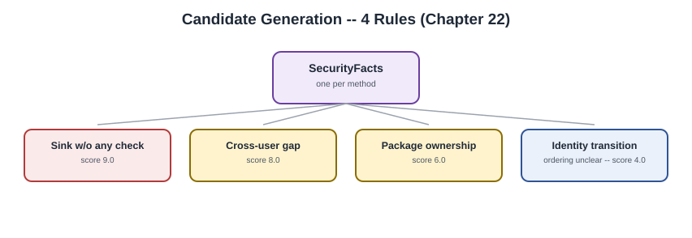

كيف يتحوّل الكود المُحلَّل إلى حقائق حتمية (Security Facts)، ثم إلى قائمة Candidates مرتَّبة بالـscore وليس بحكم نهائي. راجع [الجزء العاشر](./part-10-static-analysis.md).

---

## 4. من الـCall Graph إلى الـContext الجاهز للنموذج

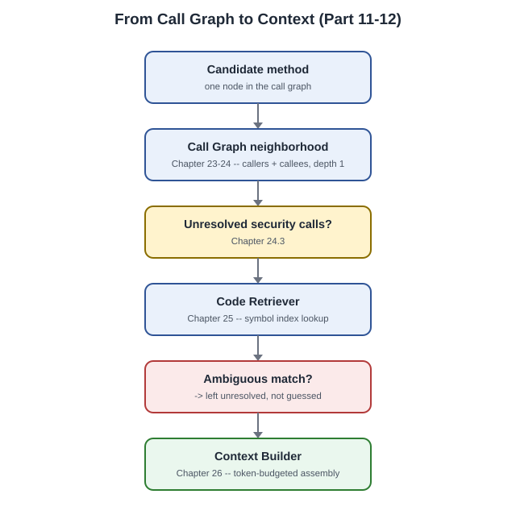

يوضح كيف تُحل الاستدعاءات غير المؤكَّدة عبر الـRetriever، ولماذا الغموض يُترَك صراحة بدل التخمين. راجع [الجزء الحادي عشر](./part-11-call-graph.md) و[الجزء الثاني عشر](./part-12-retrieval.md).

---

## 5. بناء عينات التدريب من الـPatches

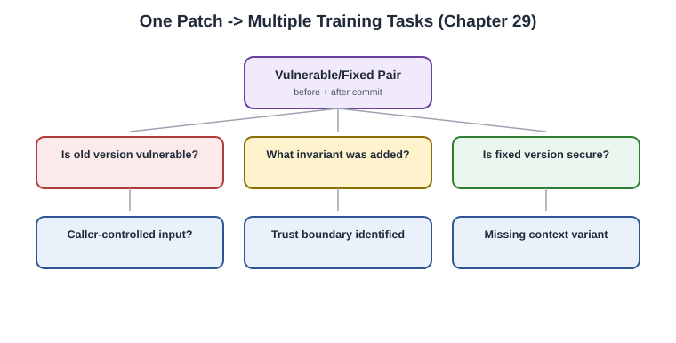

كيف يُنتِج patch حقيقي واحد عدة مهام تدريب مختلفة، بدل عينة واحدة تُعلّم النموذج الحفظ بدل الفهم. راجع [الجزء الرابع عشر](./part-14-vulnerable-fixed-pairs.md).

أهم مصدر لتقليل False Positives — أنماط تبدو خطرة شكليًا وهي آمنة فعليًا، بمراجعة بشرية 100%. راجع [الجزء الخامس عشر](./part-15-secure-negatives.md).

---

## 6. منع تسرب البيانات

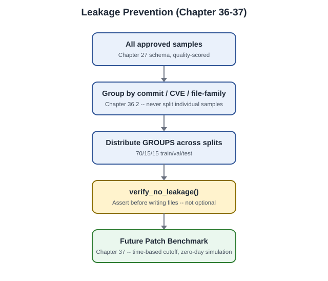

التقسيم الهرمي (commit/CVE/file-family) والتحقق الإلزامي قبل كتابة أي ملف split، وصولًا لأقوى اختبار — Future Patch Benchmark. راجع [الجزء التاسع عشر](./part-19-leakage-prevention.md).

---

## 7. التدريب

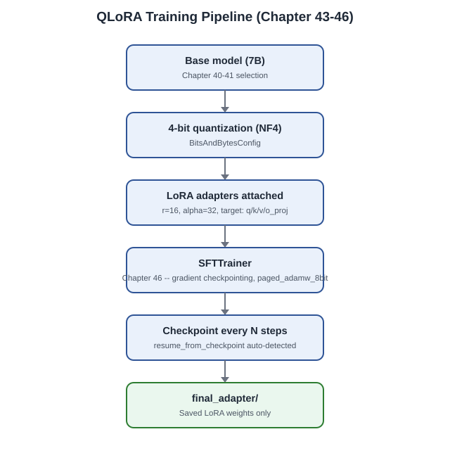

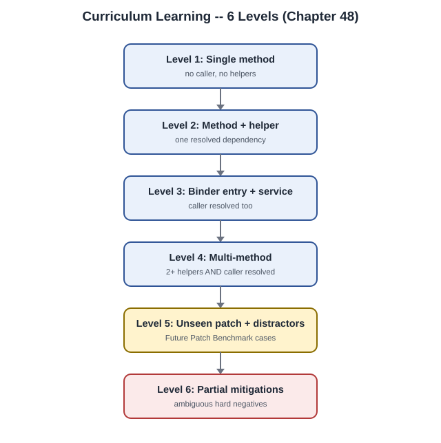

خط تدريب QLoRA الكامل من النموذج الأساسي للـadapter النهائي، والترتيب التدريجي لصعوبة العينات عبر ستة مستويات. راجع [الجزء الثالث والعشرون](./part-23-qlora.md)، [الرابع والعشرون](./part-24-sft.md)، و[الخامس والعشرون](./part-25-curriculum.md).

---

## 8. توليد البيانات بمساعدة Teacher Model

كيف تُولَّد زوايا تحليل إضافية حول كود حقيقي (وليس كودًا متخيَّلاً)، وكيف يتم ربط النموذج المعلّم بالـPipeline عبر طبقتين (Bulk + Verification). راجع [الجزء السادس والعشرون](./part-26-synthetic-data.md) و[الجزء الحادي والثلاثون](./part-31-teacher-model.md).

---

## 9. الـAgent وأدواته

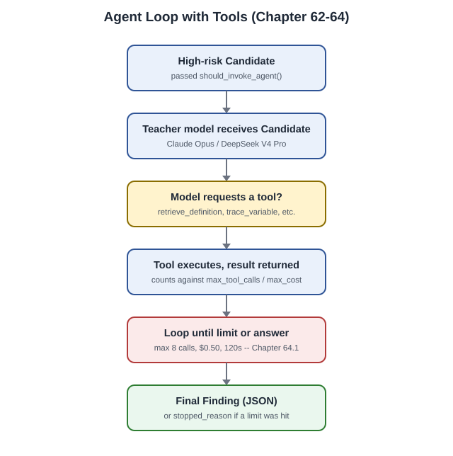

حلقة الـAgent الكاملة مع الأدوات الخمس، والحدود الصارمة (max_tool_calls, max_cost, timeout) اللي بتمنع الاستدعاءات اللانهائية. راجع [الجزء الثاني والثلاثون](./part-32-agent-architecture.md).

---

## 10. التحقق الديناميكي

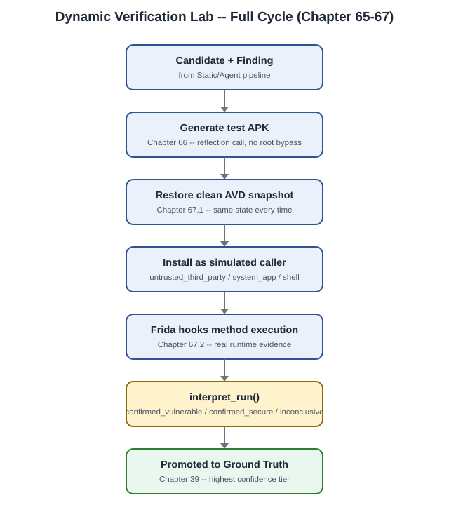

الدورة الكاملة من Candidate لحد Ground Truth مؤكَّد بدليل تنفيذي فعلي عبر Emulator + Frida. راجع [الجزء الثالث والثلاثون](./part-33-dynamic-verification-lab.md).

---

## 11. انضباط الثقة

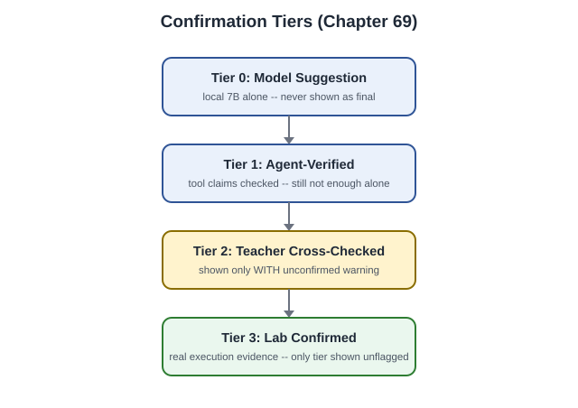

التسلسل الهرمي الإلزامي — لا Finding نهائي بدون تأكيد المختبر الديناميكي (Tier 3)، بصرف النظر عن كم طبقة نموذج وافقت عليه. راجع [الجزء الرابع والثلاثون](./part-34-confirmation-tiers-containment.md).

---

## 12. خارطة التنفيذ الكاملة

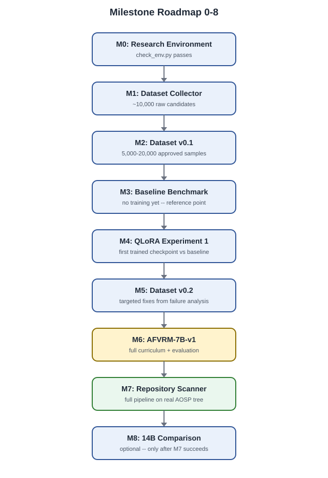

تسلسل المحطات التسع من إعداد البيئة (M0) لحد Repository Scanner الكامل (M7) وتجربة الـ14B الاختيارية (M8). راجع [الجزء التاسع والعشرون](./part-29-calibration-and-beyond.md).

---

## جدول مرجعي سريع — كل رسمة وموقعها

| # | الرسمة | الملف | الجزء المرجعي |
|---|---|---|---|
| 1 | المعمارية الكاملة | `master_architecture.svg` | الجزء 1 |
| 2 | جلب AOSP | `source1_aosp_fetch.svg` | الجزء 6 |
| 3 | تعدين Patches | `source2_patch_mining.svg` | الجزء 7 |
| 4 | جامع النشرات الأمنية | `source3_bulletin_collector.svg` | الجزء 8 |
| 5 | استخراج Security Facts | `security_facts_extraction.svg` | الجزء 10 |
| 6 | قواعد Candidate Generation | `candidate_generation_rules.svg` | الجزء 10 |
| 7 | Call Graph إلى Context | `call_graph_to_context.svg` | الجزء 11-12 |
| 8 | Patch إلى Samples | `patch_to_samples.svg` | الجزء 14 |
| 9 | Hard Negative Mining | `source4_hard_negative.svg` | الجزء 15 |
| 10 | منع التسرب | `leakage_prevention.svg` | الجزء 19 |
| 11 | خط تدريب QLoRA | `qlora_training_pipeline.svg` | الجزء 23-24 |
| 12 | مستويات Curriculum | `curriculum_levels.svg` | الجزء 25 |
| 13 | توليد Synthetic | `source5_synthetic.svg` | الجزء 26 |
| 14 | ربط Teacher Model | `teacher_model_integration.svg` | الجزء 31 |
| 15 | حلقة الـAgent | `agent_loop.svg` | الجزء 32 |
| 16 | دورة المختبر الديناميكي | `dynamic_lab_cycle.svg` | الجزء 33 |
| 17 | Confirmation Tiers | `confirmation_tiers.svg` | الجزء 34 |
| 18 | خارطة Milestones | `milestone_roadmap.svg` | الجزء 29 |

> **ملاحظة:** هذا الدليل البصري يغطي المراحل الرئيسية للـPipeline، وليس كل فصل فرعي بالتفصيل الكامل (زي مكتبة الـ50 Invariant في الفصل 9، أو الـTaxonomy الكامل في الفصل 10) — تلك المحتويات نصية بطبيعتها (قوائم وقواعد تصنيف) ولا تستفيد من تمثيل بصري إضافي، فيُكتفى بالجداول الموجودة في مكانها الأصلي.

---

[← الجزء الرابع والثلاثون](./part-34-confirmation-tiers-containment.md) · [الفهرس](./README.md)
